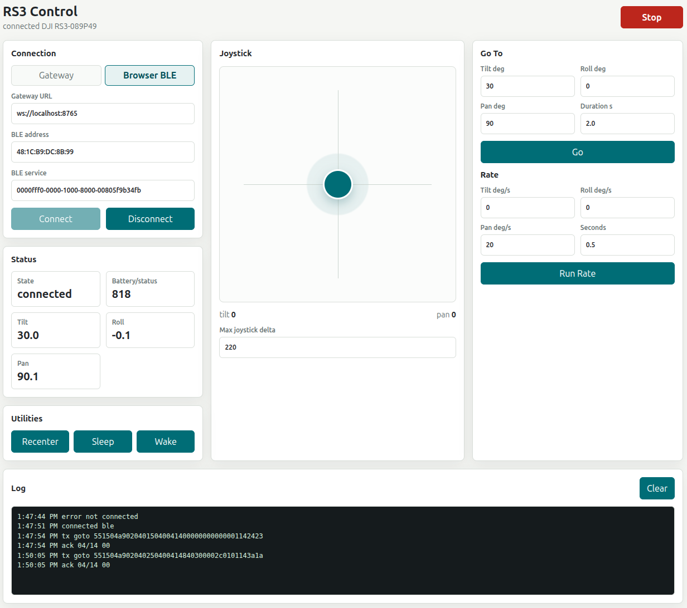

# DJI RS3 gimbal protocol documentation and control software

This project documents the [DJI RS3](https://store.dji.com/ie/product/dji-rs-3) bluetooth low energy (BLE) radio protocol and provides a library and some sample code to control the gimbal from computer programmes.

To the best of my knowledge this protocol has not been documented anywhere else. This documentation has been achieved by reverse-engineering the protocol from 
bluetooth packet logs with the aid of OpenAI gpt-5.5. It is a work in progress. 

When reverse engineering the protocol the device firmware is version ? and the DJI Ronin app version v2.1.2(6936).

This protocol may apply to other DJI gimbals but since I only have a RS3 I cannot verify. 

 * [DJI RS3 BLE protocol documentation](./rs3_ble_protocol_spec.md)
 * [DJI RS3 python control library](./python/README.md)
 * [Pose stream reverse-engineering experiments](./experiments/pose_stream_experiments.md)
 * [RS3 web control app](https://jdesbonnet.github.io/dji_rs3_control/web/)

## Web App Screenshot

