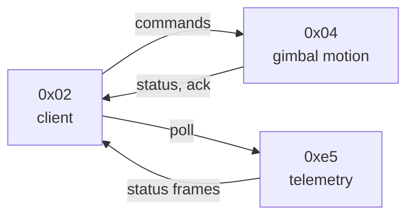

# Critique: `rs3_ble_protocol_spec.md` Format

A review of the current 910-line BLE protocol spec, with concrete proposals
to make it more scannable for humans while remaining easy to parse for AI
agents. Not a rewrite plan - a list of changes ordered by impact-to-effort.

## Summary

The spec is **structurally correct and complete**. It reads as a flat sequence
of nearly-identical command sub-pages, which makes it heavy to skim. The
verbosity has four discrete causes (listed below); none require a redesign.
A focused pass implementing the P0+P1 items at the end of this doc should
bring the spec from ~910 lines to ~600 while *increasing* both human
scannability and agent-parseability.

## What Already Works (Preserve)

- Stable, consistent terminology: `cmd_type`, `cmd_set`, `cmd_id`, `payload`
  used the same way everywhere. No synonyms drift in.
- Hex codes are inline code spans (`` `0x04/0x14` ``), so they grep cleanly.
- Plain-ASCII byte/offset tables are parseable by both eyes and tools.
- Numeric section anchors (`#5-joystick-control-command`) are stable.
- One `> [!CAUTION]` admonition at the top sets honest expectations.
- Stability tags `[SPECULATIVE]` / `[PARTIAL]` are used and tell readers
  what is solid vs. inferred.

These are the properties that make the doc work today. The critique below
assumes all of these stay.

## Verbosity Issues

### V1. Repeated command-identity blocks

Each of ~15 command sections opens with the same 5-line block:

```text
sender     0x02
receiver   0x04
cmd_type   0x40
cmd_set    0x04
cmd_id     0x0X
```

That is roughly 75-90 lines of boilerplate. The same information can fit on
one line per command. Proposed compact form:

```text
0x04/0x14   absolute angle goto     0x02 → 0x04   type=0x40   [STABLE]
```

Or, if you want a slightly richer header per section, a four-row table:

| code | direction | type | stability |
| --- | --- | --- | --- |
| `0x04/0x14` | `0x02 → 0x04` | `0x40` | STABLE |

Either form is two or three lines instead of six, with the *same* fields.

### V2. Prose duplicates structured tables

Multiple command sections have the offset table immediately followed by a
paragraph that re-says the same fields in English ("the first two bytes are
the pan target in tenths of a degree, followed by..."). Pick the structured
table as the source of truth and drop the paragraph - or vice versa, but
not both.

Concrete examples: sections 5.2 (joystick payload), 6.1 (native rate), 6.2
(absolute angle).

### V3. Conventions repeated per command

The same conventions appear three or four times across the doc:

- "neutral = 1024 (0x0400)"
- "tenths of a degree" / "0.1 deg/s"
- "u16le" / "s16le" / "little-endian"
- The axis numbering convention (axis0 = tilt, axis1 = roll, axis2 = pan)

A single **Conventions** subsection near the top (suggested location:
section 1.1 or after section 4.1 endpoint IDs) consolidates these. Later
sections then just say "axis2 target in tenths of a degree" and let the
reader cross-reference.

### V4. CRC sections specify algorithm without linking the reference impl

Sections 3.3 and 3.4 give polynomial, seed, and byte order - enough for a
careful reader to implement from scratch. The repo already contains a
working reference at `python/rs3/protocol/duml.py`. A one-line link in
each subsection makes the sections shorter *and* more useful to an
implementer.

## Readability / Visual-Hierarchy Issues

### R1. No way to scan for direction at a glance

Every command section looks identical. A reader who wants "what notifications
can the gimbal send me?" has to read each `sender/receiver` line. A direction
arrow icon (`→` host→gimbal, `←` gimbal→host, `↔` bidirectional) in each
section heading would let the eye filter without parsing.

### R2. Single mermaid diagram in 910 lines

Only section 2.3 (Absolute Angle Goto Sequence) has a sequence diagram.
Several other interactions have similar shape and would benefit from the
same treatment - listed under "Visual additions" below.

### R3. DUML frame format split between two visual forms

Section 3.1 has both:

- A vertical offset table in a plain code block.
- A horizontal HTML byte-map table.

They convey the same data twice in different visual idioms. Keep one. The
horizontal byte-map is the more "spec-like" rendering and can be enhanced
with cell color (see C2 below).

### R4. Stability tags placed inconsistently

Sometimes the tag is on the section heading (`### 6.5 ... [SPECULATIVE]`),
sometimes inline within a field row (`[SPECULATIVE]` after a field
description), and sometimes implicit in the prose. A single placement rule
("tag goes in the section header, never inline") would make it possible to
scan stability with a glance at the table of contents.

## Visual Additions to Consider

### Va. Endpoint topology diagram

At the head of section 4 (Endpoints and Command Types), a small flow
diagram showing who-talks-to-whom:



(Mermaid renders on GitHub and respects per-node `style` for color.)

### Vb. Per-command sequence diagrams

Three interactions are non-trivial enough to be worth a sequence diagram
each, all using the same idiom already established in 2.3:

- **Joystick burst** (5.4): pre-neutral frames → motion frames → post-neutral.
- **Calibration** (6.11/6.12): trigger → silent gap → progress stream →
  terminal frame. *Especially* worth visualizing because the timing is
  load-bearing (the ~5.3 s gap, the 34 s stream).
- **Sleep / wake handshake** (6.4): command → status notification.

### Vc. Frame layout as a colored byte-strip

The existing HTML byte map in 3.1 could carry semantic color by field
group, using inline `bgcolor` attributes that GitHub-flavored markdown
renders:

```html
<table>
  <tr>
    <td bgcolor="#cfe2ff">start</td>
    <td bgcolor="#cfe2ff">len_lo</td>
    <td bgcolor="#cfe2ff">ver_len_hi</td>
    <td bgcolor="#cfe2ff">hdr_crc8</td>
    <td bgcolor="#d1e7dd">snd</td>
    <td bgcolor="#d1e7dd">rcv</td>
    <td bgcolor="#d1e7dd">seq</td>
    <td bgcolor="#fff3cd">cmd_type</td>
    <td bgcolor="#fff3cd">cmd_set</td>
    <td bgcolor="#fff3cd">cmd_id</td>
    <td bgcolor="#f8d7da">payload</td>
    <td bgcolor="#e2e3e5">crc16</td>
  </tr>
</table>
```

Groups become visually obvious (header / addressing / opcode / payload /
trailer) without adding any prose.

### Vd. Command summary with badges and direction column

Section 4.3's command summary table could carry direction arrows and
shields.io stability badges:

| code | dir | name | stability |
| --- | --- | --- | --- |
| `0x04/0x01` | → | joystick control |  |
| `0x04/0x08` | → | calibration trigger |  |
| `0x04/0x66` | ← | status telemetry |  |

Badges render on GitHub (they are just `` tags) and add color without
HTML inline-style proliferation.

## Judicious Color (Within GFM Constraints)

GitHub-flavored markdown does not give us free CSS, but four mechanisms
survive its renderer:

1. **GFM admonitions**: `> [!NOTE] / [!TIP] / [!WARNING] / [!CAUTION] /
   [!IMPORTANT]`. Bordered, color-coded callouts. Currently used once.
   Worth adding to:
   - `[!WARNING]` on destructive commands - notably `0x04/0x08`
     (calibration) and `0x04/0x4c` (recenter).
   - `[!CAUTION]` on speculative-but-tempting commands.
   - `[!NOTE]` on conventions, ack patterns, and timing constraints.
2. **shields.io badges** for stability, as above. Stable green / partial
   yellow / speculative red maps directly to the existing three-tag system.
3. **Mermaid diagrams** with per-node `style` directives for direction
   coloring.
4. **HTML `bgcolor` cells** in tables for the frame-layout byte strip.

What to avoid:

- Color for its own sake. Color earns its place when it carries semantic
  meaning. Three axes are worth color-coding here: **stability**,
  **direction**, **risk**. Anything else is decoration and should be cut.
- Color as the *only* signal for a property. Every colored element should
  also carry text (the badge says "STABLE" *as well as* being green), so a
  monochrome reader, a screen reader, or an agent's text extraction loses
  nothing.

## AI-Agent Friendliness

The current spec is already reasonably agent-friendly. The properties that
make it so (listed under "What Already Works") need to be actively
protected when adding visuals.

### Risks introduced by visual changes

- **Sequence diagrams that are the only source of timing info.** If the
  calibration timing diagram lives only in Mermaid, an agent reading raw
  markdown sees a fenced block of node syntax and may not extract "5.3 s
  delay" cleanly. Mitigation: keep the timing as prose *and* as a diagram.
- **Image-only diagrams.** Embedded PNG/SVG would be opaque to agents. Use
  Mermaid (text) or HTML tables (text) instead.
- **Stability badges replacing the textual tag.** A shields.io badge image
  is an ``; agents that read alt text are fine, but agents
  that strip images lose the signal. Mitigation: keep the textual tag too,
  e.g. ``[STABLE] ``.

### Active improvements for agents

Add a **machine-readable command index** at the head of section 4.3 in a
collapsed `<details>` block. Humans skip it; agents grep it:

```yaml
commands:
  - code: 0x04/0x01
    sender: 0x02
    receiver: 0x04
    cmd_type: 0x40
    name: joystick_control
    stability: stable
    section: "5"
  - code: 0x04/0x08
    sender: 0x02
    receiver: 0x04
    cmd_type: 0x03
    name: calibration_trigger
    stability: partial
    section: "6.11"
  # ...
```

This is strictly additive - the existing human-friendly table stays - and
turns the doc into a usable source for codegen, tooling, or quick agent
lookups.

## Concrete Refactor Proposal

Ordered by impact-to-effort.

### P0 - low effort, high impact

1. Add a **Conventions** subsection (V3) listing units, axis numbering,
   endianness, neutral values. Remove the per-command repetition.
2. Replace each command's 5-line identity block (V1) with a one-line summary
   or compact four-column table.
3. Drop prose paragraphs that duplicate offset tables (V2).
4. Add direction-arrow column to the section 4.3 command summary (R1).
5. Add a one-line link from sections 3.3/3.4 to
   `python/rs3/protocol/duml.py` (V4).
6. Move every `[SPECULATIVE]` / `[PARTIAL]` tag to the section heading
   consistently (R4).

### P1 - medium effort

7. Add an endpoint topology Mermaid diagram at section 4.1 (Va).
8. Add sequence diagrams for calibration and joystick-burst flows (Vb).
9. Recolor the DUML frame byte-strip with field-group `bgcolor` and remove
   the redundant vertical offset table (R3, Vc).
10. Add `> [!WARNING]` admonitions to the destructive commands (`0x04/0x08`,
    `0x04/0x4c`).

### P2 - nice to have

11. Add the YAML command index in a `<details>` block at section 4.3 (the
    agent-friendliness addition above).
12. Add a sleep/wake sequence diagram (Vb, last item).
13. Add shields.io stability badges to the command summary table (Vd).

## Estimated Impact

- P0 alone: ~150-200 lines removed, no new visuals required. The doc still
  reads the same, just less of it.
- P0 + P1: ~300-350 lines removed, several scannability wins, three new
  diagrams. ~600 lines total.
- P0 + P1 + P2: marginal extra LOC reduction; main gain is the YAML index
  for agents and the badge color in the command summary.

If only one item is implemented, choose **P0.1** (the Conventions section):
it has the largest line-count payoff and the smallest risk of breaking the
existing structure.
